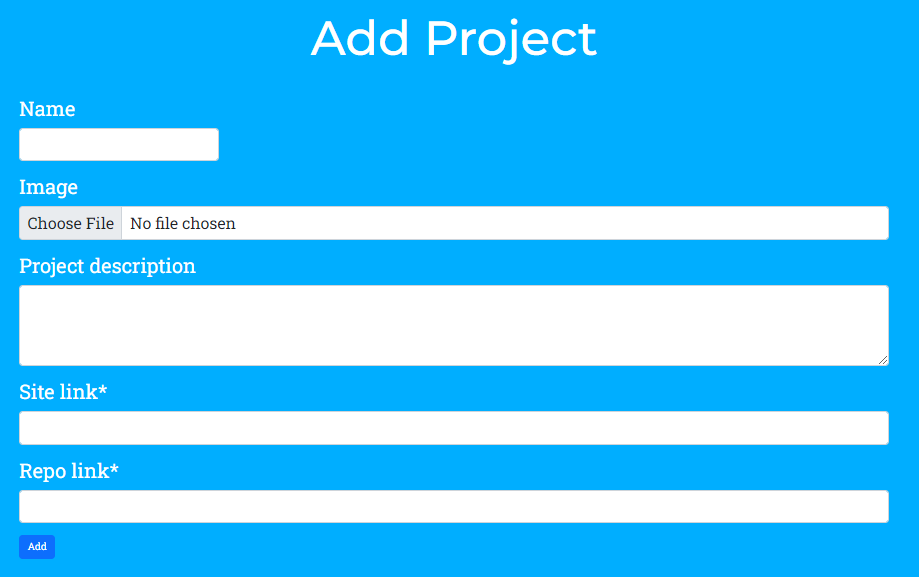

# Thomas' Personal Portfolio Webpage

[View live project here.](https://tw-portfolio-f81a23484316.herokuapp.com/)

## Introduction

Welcome to my personal portfolio page, built as my project 4 for my CodeInstitute Full Stack Software Development Diploma.
The webpage will be geared towards showcasing my skills as a developer and sharing who I am as a person.

## Table of Contents

## UX

### User Stories
* As a user, I can click navigation links so that I can easily navigate the site. 
* As a user, I can access social media links so that I can see other activity from the site owner.
* As a user, I can download the site owners CV so that I can view their professional credentials.
* As a user, I can view the skills of the site owner so that I can get an idea of how they are progressing as a developer.
* As a user, I can view basic information about the site owner so that I can get a feel of what type of person they are.
* As a user, I can view projects completed by the site owner so that I can see how they have implemented their skills.

### Admin Stories
* As an admin, I want a secure log-in so that I can access the admin dashboard.
* As an admin, I want CRUD functionality so that I can create, read, update and delete data.
* As an admin, I want log-in validation so that only super users (admins) have access to the admin dashboard.
* As an admin, I want templates to pull information from the database so that it can be viewed by general users.

## Website Goals

The goals of this website are to showcase my journey as a developer and share what I am like as a person.
There will also be functionality to download my CV.
The site will have information to highlight my skills and showcase the projects I have previously completed. 
The aim is to attract future employers and show that I would be a worthy member of their team.

## Requirements
* Landing page.
* About section.
* Skills section.
* Project showcase section.
* Downloadable CV.
* Links to social media.
* Login access for admins only to admin dashboard.
* CRUD functionality for admins to add, change or delete data.

## Design Choices

### Fonts

[Google Fonts](https://fonts.google.com/ "Google Fonts") has been used to select the fonts for the website. The font selected for the logo was [Playfair Display](https://fonts.google.com/specimen/Playfair+Display "Playfair display") as it is elegant and gives off a professional vibe. [Montserrat](https://fonts.google.com/specimen/Montserrat "Montserrat") was chosen for headings for its clean and striking aesthetic. [Roboto Slab](https://fonts.google.com/specimen/Roboto+Slab "Roboto Slab") was chosen for the body text for its readability and how easily it pairs with the other fonts selected.

### Colours

* #000080 - Navy Blue header/footer
* #00AEFF - Picton Blue background
* #FFFFFF - White Text

### Icons

The icons used for the site were sourced from [Font Awesome](https://fontawesome.com/ "Font Awesome") and [Devicon](https://devicon.dev/ "Devicon").

## Structure

The structure of the site will be simplistic as to not deter the user from engaging with the content. The main site will be broken into sections and be a continuous scroller for ease of reading. There will be a backend admin dashboard for the management of data used on the site. This dashboard will only be available to super users. The navbar will contain a login link and once logged in (admins only), the login link will change to one for the admin dashboard.

### Database Models

Home: 

| Object            | Field           |
|-------------------|-----------------|
| hero_image        | CloudinaryField |
| main_heading      | CharField       |
| brief_description | CharField       |

Personal Details: 

| Object             | Field           |
|--------------------|-----------------|
| detail_paragraph_1 | CharField       |
| detail_paragraph_2 | CharField       |
| full_name          | CharField       |
| nationality        | CharField       |
| nationality_flag   | CloudinaryField |
| residence          | CharField       |

Skill: 

| Object            | Field      |
|-------------------|------------|
| name              | CharField  |
| skill_icon        | URLField   |
| skill_description | CharField  |
| category          | ForeignKey |

Skill Category: 

| Object            | Field      |
|-------------------|------------|
| category          | CharField  |

Project: 

| Object              | Field           |
|---------------------|-----------------|
| name                | CharField       |
| project_image       | CloudinaryField |
| project_description | CharField       |
| site_link           | URLField        |
| repo_link           | URLField        |

Work History: 

| Object       | Field     |
|--------------|-----------|
| company_name | CharField |
| start_date   | DateField |
| end_date     | DateField |
| position     | CharField |

Education: 

| Object         | Field     |
|----------------|-----------|
| place_of_study | CharField |
| accreditation  | CharField |
| start_date     | DateField |
| end_date       | DateField |

## Wireframes

Wireframes have been created using [Balsamic](https://balsamiq.com "Balsamic"). These wireframes gave a basic view of how my portfolio was going to be laid out. The layout may have changed slightly in the finished product.

*Home Desktop Wireframe* 

*Home Mobile Wireframe* 

*About Desktop Wireframe* 

*About Mobile Wireframe* 

*Skills Desktop Wireframe* 

*Skills Mobile Wireframe* 

*Projects Desktop Wireframe* 

*Projects Mobile Wireframe* 

## Features

### Home Section

The landing page will feature an image of myself along with some basic information in regards to the site.

*Home Desktop* 

*Home Mobile* 

### Navbar

The navbar will be present on all pages and will contain navigation links to all the pages on the site. Once logged in as admin, an additional button for the dashboard will show on the navbar. There will be a different navbar for the dashboard, only consisting of a home, dashboard and logout link. The navbar will change to a toggle icon with a dropdown list once the screen size drops below a certain width.

*Navbar Desktop* 

*Navbar Mobile* 

*Navbar Admin* 

*Navbar Dashboard* 

### About Me Section

The about me section will give more information about myself than the original landing page. Information such as my current location, more on my coding journey and work history.

*About Desktop* 

*About Mobile* 

### Skills Section

Tne skills section will highlight what coding related skills I have learned thus far and how strong of an understanding I have with each. The skills page will show a table with icons for each skill which will be a clickable button. When clicked, the description box will update with more detailed information about that particular skill.

*Skills Desktop* 

*Skills Mobile* 

### Projects Section

The project section will contain a look at all the projects I have completed so far with links to the repositories and the live sites for each. There will be an image and brief description of each project.

*Projects Desktop* 

*Projects Mobile* 

### CV Section

The CV section will contain a link to my CV on my GitHub repository where the user can download it.

*CV Desktop* 

*CV Mobile* 

### Admin Dashboard

The admin dashboard will be used to create, update or delete information used on the site. This will only be available to admins and will be accessable once logged in.

*Dashboard Desktop* 

*Dashboard Mobile* 

### Footer

The footer will be present on each page and contain links to my social accounts.

*Footer* 

## Admin Dashboard

For security purposes, the admin dashboard is only available to super users (admins). To login as an admin, you must navigate to the admin login by putting /admin at the end of the site url. Once logged in, you will be taken to the default django backend dashboard. You can navigate back to the site using the view site link in the navigation bar. Once back to the main site, a new link for the dashboard in the navigation bar will be present. Any attempts to navigate to the admin dashboard or any related page will result in redirection to the home page if the user is not logged in.

## CRUD Functionality

CRUD functionality is fully available in the admin dashboard. The dashboard itself contains cards for each model with the option to add, edit and delete data dependent on the model. The buttons on the cards will take you to each individual page for change in data.

### Home

The home section will only have an edit page as there is no need to add or delete any data.

*Edit Home* 

### About

The about section will only have an edit page. As this page is very similar to the edit home page, I have opted not to add a screenshot for this page.

### Skills

The skills section will have options to add, edit or delete data. It is important to be able to add more skills as I progress as a developer. In the edit and delete pages, the form will be accompanied by a table containing all of the current skills. Clicking on a particular skill will reload the page and propagate the form with that skills information.

*Add Skill* 

*Edit Skill* 

*Delete Skill* 

### Projects

The project section will have the options to add, edit or delete data. As I complete more projects, I need the ability to add these to the database. A list of the projects will accompany the form and can be selected to propagate the specific information for editing and deleting purposes.

*Add Project* 

*Edit Project* 

*Delete Project* 

### Work History

The work history section will have the options to add or edit data. There is no need to have a delete function in this section.

### Education

The education section will be the same as for the work history section.

## Testing

## Technologies Used

### Languages

* [HTML](https://en.wikipedia.org/wiki/HTML "HTML")
* [CSS](https://en.wikipedia.org/wiki/CSS "CSS")
* [JavaScript](https://en.wikipedia.org/wiki/JavaScript "JavaScript")
* [Python](https://en.wikipedia.org/wiki/Python_(programming_language) "Python")

### Libraries & Framework

* [Django](https://en.wikipedia.org/wiki/Django_(web_framework) "Django")
* [Bootstrap](https://getbootstrap.com/ "Bootstrap")
* [Google Fonts](https://fonts.google.com "Google Fonts")

### Databases
 * [PostgreSQL](https://www.postgresql.org/ "PostgreSQL")
 * [ElephantSQL](https://www.elephantsql.com/ "ElephantSQL")

### Tools

* [GitHub](https://github.com "GitHub")
* [Gitpod](https://gitpod.io "Gitpod")
* [Balsamic](https://balsamiq.com "Balsamic")
* [Coolors](http://coolors.co "Coolors")
* [DevTools](https://developer.chrome.com/docs/devtools "DevTools")
* [Gunicorn](https://en.wikipedia.org/wiki/Gunicorn "Gitpod")
* [Cloudinary](https://cloudinary.com/ "Cloudinary")
* [Heroku](https://heroku.com "Heroku")
* [Psycopg](https://wiki.postgresql.org/wiki/Psycopg "Psycopg")
* [Crispy Forms](https://django-crispy-forms.readthedocs.io/en/latest/ "Crispy Forms")